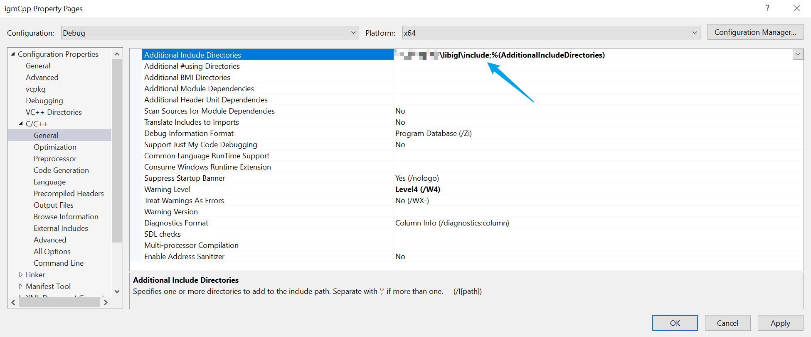

<!-- title img and links -->


<h1 align="center">IG-Mesh</h1>
<div align="center">
	<a href="https://github.com/xarthurx/IG-Mesh/">Home</a>
  <span> • </span>
	<a href="https://github.com/xarthurx/IG-Mesh/#Installation">Install</a>
  <span> • </span>
       	<a href="https://github.com/xarthurx/IG-Mesh/#Contribution">Contribute</a>
  <p></p>
</div> 


<!-- shields.io stuff -->
<div align="center">

<a href="https://www.rhino3d.com/" >
 </a>

<a href="https://www.grasshopper3d.com" >
 </a>

<a href="https://github.com/xarthurx/IG-Mesh/blob/master/LICENSE" >
 </a>

</div> 

## A mesh processing library for Grasshopper & Rhino

[**IG-Mesh**](https://github.com/xarthurx/IG-Mesh/) (standing for "I Get a Mesh..." or "Igl-Grasshopper Mesh") is a grasshopper plugin for both low-level and advanced mesh processing.

The library features tools for extracting both low-level information (e.g. vertex, edge, face relationship) and high-level properties (e.g. isolines, quad-planarization) that many mesh processing plugins do not provide.

**IG-Mesh** is developed for the general architecture, design, and fabrication community, hoping to fill the gap of mesh operations in any design-to-fabrication pipelines. The goal is to resolve the long-lasting pain of interactive mesh processing on the [Rhino](https://www.rhino3d.com) \& [Grasshopper](https://www.grasshopper3d.com) platform.

### Components Overview


### Showcase 
<p align="center">
  
</p>


### Highlighted Components
#### <u>universal random points (blue noise)</u>:


<details><summary> More (Click to expand!)... </summary>

#### <u>fast geodesic distance</u>:


#### <u>mesh isoline</u>:


#### <u>quad-mesh planarization</u>:


</details>

## ALPHA-phase and Use case collection
**This library is currently under the alpha-phase for initial public test. To further improve it, your contribution is needed.**

Please submit an issue and describe what your mesh processing task requires and what type of functions are missing.

I will add the corresponding functions to the library after evaluation, ASAP.


## Installation 

### Install with **PackageManager** (Rhino 7+)
1. Open Rhino and run command `PackageManager`.
2. Search for "**IG-Mesh**".
3. Install the plugin and restart Rhino.

### Food4Rhino 
The [Project Page](https://www.food4rhino.com/en/app/ig-mesh) on Food4Rhino also holds major release versions of this library.

### Pre-compiled release
Pre-compiled releases are available on the [GitHub repo](https://github.com/xarthurx/IG-Mesh).

1. Download the `.zip` file from [the latest release](https://github.com/xarthurx/IG-Mesh/releases/latest).
2. Unzip the `.zip` file and put the folder into you *Grasshopper Component Folder*.
3. Restart *Rhino* and *Grasshopper*.

*Releases with minor updates will only be published as pre-compiled releases and be hosted on github.*


## Planned Feature 
### TODO
Below are the current planned features to be added in the next release:
- ~~planarization using [*Shape-Up*](https://lgg.epfl.ch/publications/2012/shapeup/index.php)~~ (done in v0.2)
- ~~Fast geodesic distance based on the "Heat-kernel" method~~ (done in v0.2)
- Half-Edge structure


### Future Plan (Non-Goal TODO)
Below is an incomplete list of functions that `IG-Mesh` plans to provide. The list is constantly adjusted based on feedback:

- edge-related functions for vector fields operation 
- Various approaches for unrolling mesh (parametrization)
- FEM-related functions (need evaluation on speed and computational efficiency)
- voxel (tet-based) processing functionality


## Contribution

You need `Visual Studio 2019` (2022 is not supported by McNeel) and the `.NET` framework to compile the project.

### Dependence
#### `openNURBS`
1. Install the official [Rhino SDK](https://www.rhino3d.com/download/Rhino-SDK/7.0/latest/).
2. Build the `iglCpp` project -- if no error occurs, the SDK is installed successfully.


#### `libigl`

1. Download the [libigl](https://libigl.github.io) library to your local desk. 
2. Add the `include` dir in the Property Page of `igmCpp`.



#### `Eigen`
Both `IG-Mesh` and `libigl` requires `Eigen3`. The `vcpkg` approach is recommended, though you can also manually link the library in the Solution Property Page.


#### `nuget` 
In the `NuGet` package manager of `Visual Studio`, you should install the following packages for the solution:
- `System.Collections`
- `System.Runtime`
- `Grasshopper`
- `RhinoCommon`

### Build
You should now be able to build the whole solution and generate the `.gha` and `.dll` files.


## Acknowledgement and License

Many of the base functions are converted from the geometry processing library [libigl](https://libigl.github.io), and ported into C# environment through the [PInvoke](https://www.grasshopper3d.com/forum/topics/link-use-c-code-or-c-lib-with-new-gh-plugin) methods and [openNURBS](https://github.com/mcneel/opennurbs).

The author would like to pay his deepest gratitude to the developers for this library and the responsive Q\&A during the past years[^1].

[^1]: *The name of this library is also partially inspired by the [libigl](https://libigl.github.io) library.*

**The library is released under the [GPL licence](https://github.com/xarthurx/IG-Mesh/blob/master/LICENSE).**

---
## Credit & Citation 
Author: [Zhao Ma](https://beyond-disciplines.com)

If `IG-Mesh` contributes to an academic publication, please cite it as:
```bib
@software{ig-mesh,
  title = {IG-Mesh},
  author = {Zhao Ma},
  url = {https://github.com/xarthurx/IG-Mesh},
  doi = {10.5281/zenodo.6499203},
  version = {0.2.8}
  year = {2022}
}
```
You can also find the reference infomation on [Zenodo.org](https://zenodo.org/record/6499203).
