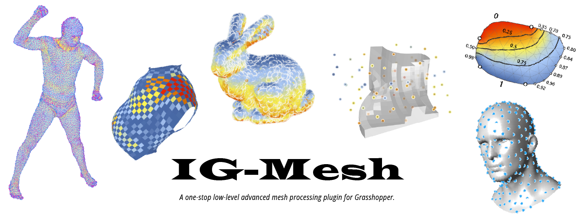
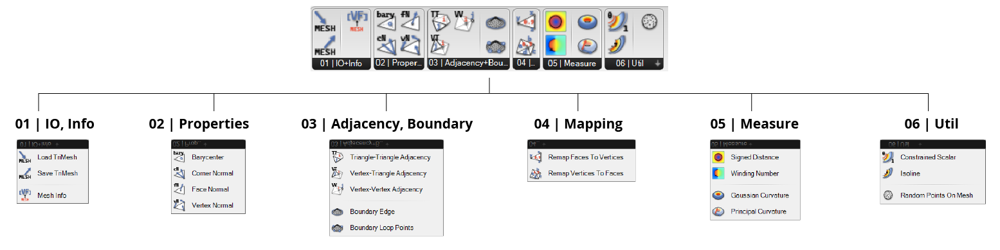

# IG-Mesh



## A mesh processing library for Grasshopper (Rhino)

`IG-Mesh`, standing for `I Got a Mesh` or `Igl-Grasshopper Mesh`, is a grasshopper plugin for low-level triangular mesh processing.

The library is developed for the general architecture, design, and fabrication community, hoping to provide solutions for low-level (vertex-based, edge-based) mesh operations. 

The goal is to resolve the long-lasting pain for mesh processing on the [Rhino](https://www.rhino3d.com) \& [Grasshopper](https://www.grasshopper3d.com) platform.




## Download & Installation 

### Install with **PackageManager** (Rhino 7+)
1. Open Rhino and run command `PackageManager`.
2. Search for "IG-Mesh".
3. Install and restart Rhino.

### pre-compiled release
Pre-compiled releases are available on the [GitHub repo](https://github.com/xarthurx/IG-Mesh).

1. Download the `.zip` file for your OS from [the latest release](https://github.com/xarthurx/IG-Mesh/releases/latest).
2. Unzip the `.zip` file and put the folder into you "Grasshopper Component Folder".
3. Restart Rhino.

### Food4Rhino 
The [project page on Food4Rhino](https://www.food4rhino.com/en/app/ig-mesh) also holds major release versions of this library.

## Library credit

Many of the base functions are converted from the geometry processing library [libigl](https://libigl.github.io), and ported into C# environment through the [PInvoke](https://www.grasshopper3d.com/forum/topics/link-use-c-code-or-c-lib-with-new-gh-plugin) methods. 

The author would like to pay his deepest gratitude to the developers for this library and the responsive Q\&A during the past years [^1].

The rest funcitons are developed by the author in `C++` and ported to `C#` in the same manner.

[^1]: *The name of this library is also partially inspired by the [libigl](https://libigl.github.io) library.*


## Alpha phase and Use case collection
**This library is currently under the alpha phase for initial public test. To improve it one-step further, your contribution is needed.**

Please submit an issue and describe what your mesh processing task requires and what type of functions are missing.

I will add the corresponding functions to the library after evaluation, ASAP.


## Planned Feature 
Below are the current planned features to be added in the next release:
- planarization using ['Shape-Up'](https://lgg.epfl.ch/publications/2012/shapeup/index.php)
- Half-Edge structure
- Fast geodesic distance based on the "Heat-kernel" method


## Future Plan (Non-Goal TODO)
Below is an incomplete list of functions that `IG-Mesh` plans to provide. The list is constantly adjusted based on feedback:

- edge-related functions for vector fields operation 
- Various approaches for unrolling mesh (parametrization)
- FEM-related functions (need evaluation on speed and computational efficiency)
- voxel (tet-based) processing functionality


## Compilation and Contribution

You need to install `Visual Studio 2017` or above to compile the project.

### `openNURBS`
1. Download the [openNURBS](https://github.com/mcneel/opennurbs) library to your local desk, and build it (both `debug` and `Release`) following the instructions.

2. Modify the corresponding dir in the `stdafx.h` file under project `igm_cppPort`.

### `libigl`

1. Download the [libigl](https://libigl.github.io) library to your local desk. 
2. Add the `include` dir in the Property Page of `igm_cppPort`.

### `nuget` Packages
In the `NuGet` package manager of `Visual Studio`, you should install the following packages for the solution:
- `Grasshopper`
- `RhinoCommon`
- `System.Collections`
- `System.Runtime`

### Build this library
After the above two steps, you should now be able to build the whole solution and generate the `.gha` and `.dll` file.


## Licence
The library is released under the [MIT licence](./docs/LICENCE.md).

---
## Credit & Citation 
Author: [Zhao Ma](https://beyond-disciplines.com)

If `IG-Mesh` contributes to an academic publication, please cite it as:
```bib
@software{ig-mesh,
  title = {IG-Mesh},
  author = {Zhao Ma},
  url = {https://github.com/xarthurx/IG-Mesh},
  version = {0.1.0}
  year = {2022}
}
```
